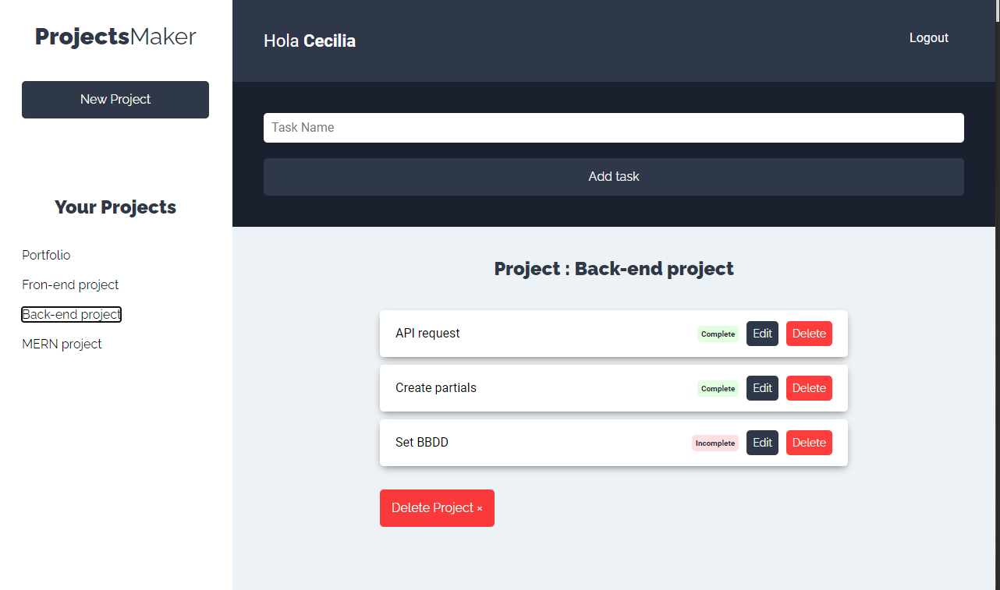

# Project-Manager---MERN

A project to practice MERN stack.

## Install

- Run `npm i` on each directory

## Technologies

- Client side
  - React.js
  - Cypress
- Server side
  - Node.js
  - Express.js
  - MongoDB
